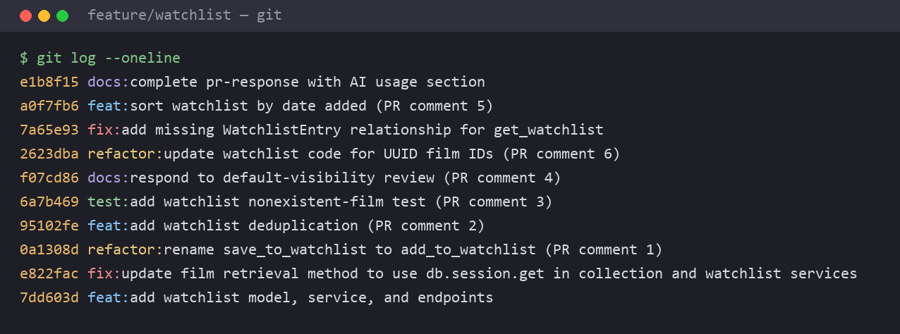

# PR Response Doc — CineLog Watchlist Feature

## AI Usage

I used Claude Code (Anthropic) as a pair-programming assistant throughout this project. How it was used, by area:

- **Environment setup:** diagnosed a `ModuleNotFoundError: flask` — the venv was active but empty and `pip` was resolving to a global Python; fixed by installing `requirements.txt` with the venv's own interpreter. Also verified the app boots and the test suite runs.
- **Reading the review:** the six review comments live on PR #1 of the upstream repo (not the fork). I used the GitHub REST API to pull the inline comments (Files changed) and the general Conversation-tab comments and mapped them to the `pr-response.md` scaffold.
- **Working the comments one at a time:** for each comment I had the AI read the relevant existing code first (e.g. `add_to_collection`, `test_collection.py`) so the change followed the project's established conventions rather than inventing new ones — `verb_to_noun` naming (Comment 1), the three-layer dedup pattern of service check + `UniqueConstraint` + route 409 (Comment 2), the fixture/assertion structure for tests (Comments 3 and 5).
- **The rebase (Comment 6):** used the AI to map the divergence and cut a backup branch before rewriting history, then resolve the `models.py` conflict (re-adding `WatchlistEntry` with a UUID `film_id`) and update the remaining integer-ID assumptions.
- **Verification:** every code change was checked by running `pytest tests/ -v` and, for behavior not covered by tests, by exercising the service against an in-memory DB. This is how the pre-existing `get_watchlist` relationship bug was caught (fixed under Comment 5).
- **The judgment calls (Comments 4 and 5):** the AI helped me articulate and pressure-test my positions, but the decisions — defending `public=True` with mitigations, and agreeing to date-added ordering — are mine. I directed the choice on the sort-order question explicitly.

All AI-assisted changes were reviewed and run locally before committing; commits are grouped one-per-comment with descriptive messages.

## Comment 1 — Rename
**What I did:** Renamed `save_to_watchlist()` to `add_to_watchlist()` in `services/watchlist_service.py` to follow the project's `verb_to_noun` naming convention (matching `add_to_collection()` in the collection service). Updated the one call site in `routes/watchlist/watchlist.py` — both the import statement and the invocation inside the `/add` endpoint.
**How I verified:** Ran a project-wide search for `save_to_watchlist` after the change and confirmed zero remaining references. Also imported both modules (`services.watchlist_service` and `routes.watchlist.watchlist`) to confirm the new name resolves correctly at every call site.

## Comment 2 — Deduplication
**What I did:** Added deduplication to `add_to_watchlist()` following the same three-layer pattern used by `add_to_collection()`:
1. **Service layer** — defined a new `AlreadyInWatchlistError` exception and, before inserting, query for an existing `(user_id, film_id)` `WatchlistEntry`; if one exists, raise the error instead of creating a duplicate.
2. **Model layer** — added `UniqueConstraint("user_id", "film_id", name="unique_user_film_watchlist")` to `WatchlistEntry` as a database-level backstop (mirrors `CollectionEntry`).
3. **Route layer** — the `/watchlist/<user_id>/add` endpoint now catches `AlreadyInWatchlistError` and returns HTTP 409 (also added the previously-missing `FilmNotFoundError` → 404 handling, matching the collection route).

**How I verified:** Ran a behavioral check against an in-memory DB: adding the same film twice raised `AlreadyInWatchlistError` on the second call and left exactly one entry in the table; a nonexistent film still raised `FilmNotFoundError`. The existing test suite continues to pass (4 passed).

## Comment 3 — Missing test
**What I did:** Created `tests/test_watchlist.py`, mirroring the fixture and assertion structure of `test_collection.py`. Added `test_add_to_watchlist_nonexistent_film_raises` — the direct equivalent of `test_add_to_collection_nonexistent_film_raises` — which asserts that calling `add_to_watchlist()` with a film_id that isn't in the database raises `FilmNotFoundError` (rather than a raw DB integrity error). Reused the same `app`, `sample_user`, and `sample_film` fixtures (in-memory SQLite, created/dropped per test). One adaptation: film IDs are integers on this branch, so the fake ID is `99999` instead of the collection test's UUID string.
**How I verified:** Ran `pytest tests/test_watchlist.py -v` — 1 passed. Full suite also green (5 passed).

## Comment 4 — Default visibility
**My position:** Keep `public=True` as the default for new watchlist entries. This is an intentional decision, not an inherited default.

**Reasoning:** CineLog is a social film-tracking network, and the watchlist is fundamentally a *discovery and social* surface — it answers "what does this person plan to watch?" The behavior I'm optimizing for is frictionless participation in that social graph: a new user who saves a film should immediately contribute to their friends' discovery feeds without first having to hunt for a privacy toggle. Public-by-default is what makes the network effect work — the product gets more valuable as more watchlist activity is visible, recommendations improve, and users can see and discuss what people they follow want to watch. Requiring an opt-in to public would leave most lists private (defaults are sticky), which would quietly gut the social feature this PR exists to build. The `public` field being per-entry also means users retain granular control — the default is a starting point, not a lock-in.

**Tradeoff acknowledged:** The real cost is privacy: a public default means a user who *assumes* their watchlist is private can unintentionally expose their viewing intentions (which can be sensitive — health, religion, sexuality can all be inferred from film choices). The more conservative alternative, `public=False` (privacy-by-default), aligns with data-minimization principles and GDPR's "privacy by design," and eliminates the accidental-exposure risk entirely; its cost is a colder start for the social features and an extra step for the majority of users who *do* want to share. I'm accepting the privacy tradeoff, but it's contingent on three mitigations that should ship alongside this default: (1) the visibility state must be clearly shown in the UI at creation time so it's never a surprise, (2) an easy per-entry public/private toggle, and (3) a first-run prompt the first time a user creates a watchlist so the default is a conscious choice. If we can't commit to at least (1) and (2), I'd switch the default to `public=False`.

## Comment 5 — Sort order
**My position:** I agree with the maintainer — changed `get_watchlist()` to sort by `date_added` descending (newest first), replacing the previous alphabetical (`Film.title`) ordering.

**Reasoning:** The deciding factor for me was internal consistency, which is an argument beyond the maintainer's original point. The sister feature `get_collection()` already sorts newest-first, so having the watchlist sort alphabetically would give the two most parallel features in the app two different ordering models — users would have to learn that "collection = recency, watchlist = A–Z" for no principled reason. A watchlist is also a *time-ordered intent queue* ("things I recently decided I want to watch"), where recency carries real signal; alphabetical order, by contrast, is essentially arbitrary with respect to what the user cares about. Implementing this also let me delete the now-unnecessary `.join(Film)` and sort directly on the `WatchlistEntry` column, matching `get_collection()` line-for-line.

**Engagement with reviewer's point:** The maintainer's claim — "most users want to see what they added recently" — is the right instinct, and I think it's *strongest* for the watchlist specifically. Unlike a collection (a durable log of everything watched, which a user might reasonably want to browse alphabetically to find a specific title), a watchlist is a shorter, more volatile "what's next" list where the most recent additions are top-of-mind. Where I'd push back slightly: "most users" isn't "all users" — someone with a 200-film watchlist scanning for one title is better served by alphabetical. Rather than keep alphabetical as the default (which would penalize the common case), I'd address that tail case later with an optional `?sort=title` query param layered on top of the date-added default. For now the default is date-added, and it's documented in the `get_watchlist` docstring so the decision is discoverable in the code, not just this doc.

**Bug fixed alongside:** implementing this surfaced a pre-existing defect — `get_watchlist()` called `entry.film.to_dict()`, but `WatchlistEntry` had no `film` relationship, so the endpoint raised `AttributeError` for any non-empty watchlist. I added `watchlist_entries` relationships (with `film`/`user` backrefs) to the `Film` and `User` models, mirroring `CollectionEntry`, and added `test_get_watchlist_returns_newest_first` (titles chosen so alphabetical order is the reverse of date order, so the test fails under the old sort and passes under the new one).

## Comment 6 — Rebase
**What conflicted:** Rebased `feature/watchlist` onto `main` (`git rebase main`), replaying 6 commits over main's int→UUID migration. The single content conflict was in `models.py`: main's UUID migration had removed the `WatchlistEntry` class, while my dedup commit tried to edit it. `app.py` (watchlist blueprint registration) and `services/collection_service.py` (the `db.session.get` switch) both replayed cleanly.

**How I resolved it:** Re-added the `WatchlistEntry` class on top of main's UUID models, changing `film_id` from `db.Integer` to `db.String(36)` so its foreign key matches the migrated `Film.id` (UUID). Kept the dedup `UniqueConstraint` from Comment 2. Then updated the remaining integer-ID assumptions "accordingly": the `add_to_watchlist` docstring (`film_id (int)` → `film_id (str): UUID`), the route's request-body doc (`<int>` → `"<uuid>"`), and the test's fake ID (`99999` → a UUID string, matching `test_collection.py`).

**How I verified no conflict remains:** Searched the tree for conflict markers (none). App boots and registers the watchlist blueprint (`/watchlist/<user_id>`, `/watchlist/<user_id>/add`). Behavioral check with a real UUID film confirmed `add_to_watchlist` persists `entry.film_id == film.id`, and dedup still raises `AlreadyInWatchlistError`. Full suite green (`pytest tests/ -v` → 5 passed). (Separately, verification surfaced a pre-existing bug — `get_watchlist()` references a `WatchlistEntry.film` relationship that was never defined — which I'll fix under Comment 5, since that comment concerns `get_watchlist` ordering.)

## Commit History

Final `git log --oneline` for the feature branch (10 commits, all Conventional Commits, no merge commits):

**Final check:** I ran this history past an AI reviewer with the prompt *"Do these commit messages follow conventional commit format? Are any messages bundling multiple logical changes that should be separate commits?"* It confirmed all messages use valid Conventional Commit types and flagged one commit that bundled a `feat` (sort) with a `fix` (relationship). I verified that against the Conventional Commits 1.0.0 spec myself and agreed, so I split it into `fix: add missing WatchlistEntry relationship for get_watchlist` and `feat: sort watchlist by date added` (visible above). No merge commits are present.

## PR Description

Adds a watchlist feature so users can save films they want to watch. Includes a new `WatchlistEntry` model, service functions (`add_to_watchlist`, `get_watchlist`), REST endpoints, and deduplication (service check + DB unique constraint).

**Default visibility decision:** New watchlist entries default to `public=True`. This is intentional: CineLog is a social film-tracking network and the watchlist is a discovery surface, so a public default lets users participate in the social graph without friction and powers friend-based discovery. The tradeoff is privacy — a public default risks users unintentionally exposing their viewing intentions — which we accept only alongside a clearly-visible visibility state in the UI, an easy per-entry public/private toggle, and a first-run prompt. (Full reasoning in "Comment 4" above.)